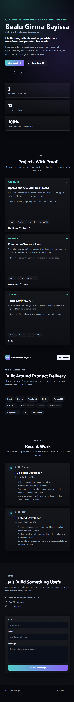

# Trysample

A small React/Vite portfolio demo project built with `react`, `react-dom`, and `vite`.

## Project structure

- `src/` — React application entry point and styles
- `scripts/preview-server.mjs` — simple static preview server for the built app
- `package.json` — npm scripts and dependencies

## Requirements

- Node.js 18+ recommended
- npm

## Setup

```bash
npm install
```

## Development

```bash
npm run dev
```

Then open `http://127.0.0.1:5173/` in your browser.

## Build

```bash
npm run build
```

## Preview

```bash
npm run preview
```

This runs Vite's preview server on `http://127.0.0.1:5173/`.

## Screenshot



## Custom preview server

You can also run the custom preview server after building the app:

```bash
node scripts/preview-server.mjs
```

## Notes

- The project includes responsive styling and a mobile-friendly layout.
- The current repository is based on a personal portfolio template.
